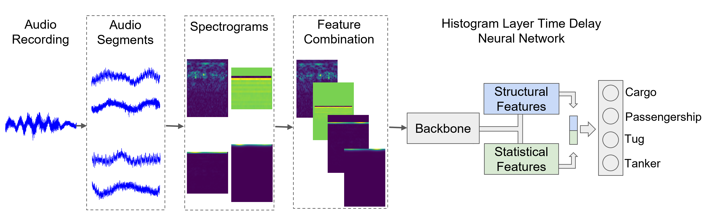

# Investigation of Time-Frequency Feature Combinations with Histogram Layer Time Delay Neural Networks:
<p align="center">
  
</p>


**Investigation of Time-Frequency Feature Combinations with Histogram Layer Time Delay Neural Networks**

Amirmohammad Mohammadi, Irene Masabarakiza, Ethan Barnes, Davelle Carreiro, Alexandra Van Dine and Joshua Peeples

Note: If this code is used, please cite it: Amirmohammad Mohammadi, Irene Masabarakiza, Ethan Barnes, Davelle Carreiro, Alexandra Van Dine and Joshua Peeples. (2024, April 25) Initial Release (Version v1.0). 

`Accepted to IEEE (LINK)

In this repository, we provide the paper and code for "Investigation of Time-Frequency Feature Combinations with Histogram Layer Time Delay Neural Networks"

## Installation Prerequisites

The [`requirements.txt`](requirements.txt) file includes the necessary packages, and the packages will be installed using:

   ```pip install -r requirements.txt```
   
Or, for a more convenient option, a pre-configured environment is available for download through the provided link. This environment comes with all the essential packages already installed, ensuring a hassle-free setup process.

[`Download environment`](https://drive.google.com/file/d/1aEYvnnuhuU3evd0FZ63ex2EdC1INGLMl/view?usp=sharing)

## Demo

To get started, please follow the instructions in the [Datasets](Datasets) folder to download the dataset.
Next, run [`demo.py`](demo.py) in Python IDE (e.g., Spyder) or command line to train, validate, and test models. 
To evaluate performance,
run [`View_Results.py`](View_Results.py) (if results are saved out).

## Main Functions

The target classification code uses the following functions. 

1. Intialize model  

   ```model, input_size = intialize_model(**Parameters)```

2. Prepare dataset(s) for model
   
   ```dataloaders_dict = Prepare_Dataloaders(**Parameters)```

3. Train model 

   ```train_dict = train_model(**Parameters)```

4. Test model

   ```test_dict = test_model(**Parameters)```

## Parameters

The parameters can be set in the following script:
   
[`Demo_Parameters.py`](Demo_Parameters.py)

## Inventory

```
https://github.com/Peeples-Lab/HLTDNN 

└── root directory
    ├── demo.py                           // Run this. Main demo file.
    ├── Demo_Parameters.py                // Parameter file for the demo.
    ├── Prepare_Data.py                   // Load dataset for the demo. 
    ├── View_Results.py                   // Run this after the demo to view saved results. 
    └── Datasets                
        ├── Get_Preprocessed_Data.py      // Resample the audio data and generate segments for the dataset.
        └── DeepShipSegments.py           // Create a custom dataset for DeepShip.
        └── Feature_Extraction_Layer.py   // Extract and transform different features from the audio files.
        └── Adaptive_Pad_Layer.py         // Resize features to a common dimension.
    └── Utils                     
        ├── Class_information.py          // Class names for dataset for the results script.
        ├── Compute_FDR.py                // Compute Fisher’s discriminant ratio.
        ├── Confusion_mats.py             // Create and plot confusion matrix.
        ├── Generate_Learning_Curves.py   // Generate learning curves for training and validation.
        ├── Generate_TSNE_visual.py       // Generate TSNE visuals.
        ├── Generate_Spatial_Dims.py      // Compute spatial dimensions for histogram layer models.
        ├── Get_Optimizer.py              // Define a set of optimizers to choose from.
        ├── Histogram_Model.py            // Load histogram model with TDNN (or any backbone network).
        ├── Network_functions.py          // Contains functions to initialize, train, and test the model.
        ├── RBFHistogramPooling.py        // Create histogram layer.        
        ├── cam_function.py               // Compute and plot a class activation map.
        ├── Save_Results.py               // Save results from the demo script.
        ├── pytorchtools.py               // Implement early stopping to terminate training based on validation metrics.
        └── TDNN.py                       // Baseline TDNN model.

```

## License

This source code is licensed under the license found in the [`LICENSE`](LICENSE) file in the root directory of this source tree.

This product is Copyright (c) 2024 A. Mohammadi, I. Masabarakiza, E. Barnes, D. Carreiro, A. Dine and J. Peeples. All rights reserved.

## <a name="CitingHist"></a>Citing

If you use the code, please cite the following reference using the following entry.

**Plain Text:**

A. Mohammadi, I. Masabarakiza, E. Barnes, D. Carreiro, A. Dine and J. Peeples, "Investigation of Time-Frequency Feature Combinations with Histogram Layer Time Delay Neural Networks," 2024 IEEE.

**BibTex:**

```
@inproceedings{Ritu2023histogram,
  title={Investigation of Time-Frequency Feature Combinations with Histogram Layer Time Delay Neural Networks},
  author={Mohammadi, Amirmohammad and Masabarakiza, Irene, and Barnes, Ethan, and Martell, Riley, and  Van Dine, Alexandra, and Peeples, Joshua},
  booktitle={2024 IEEE},
  pages={TBD},
  year={2024},
  organization={IEEE}
}
```
